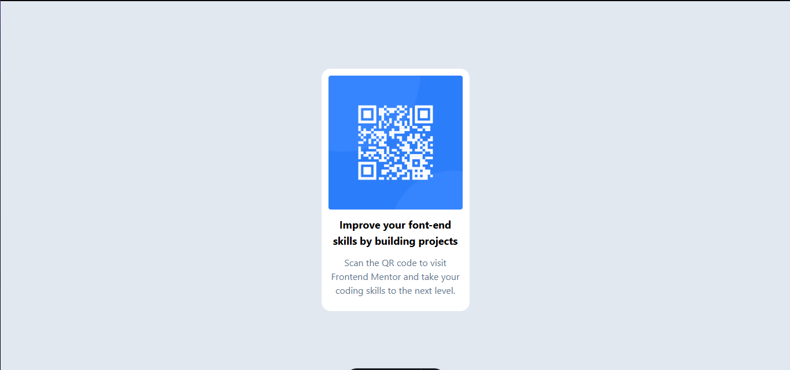

# 🏝️ Proyecto: Loopstudios Landing Page

Este proyecto consiste en el desarrollo de la **landing page de Loopstudios** utilizando **Astro** y **Tailwind CSS**.  
El objetivo es aplicar los conocimientos sobre **componentes de Astro**, **maquetación**, **estilos responsivos** y **utilidades CSS** para construir un diseño limpio, moderno y adaptable a diferentes dispositivos.

---

## 📖 Descripción general

### 🧩 Vista previa del proyecto
Agrega aquí una **captura de pantalla** del resultado final de tu landing page.  

---

### 🔗 Enlaces del proyecto

- **Repositorio en GitHub:**https://github.com/LeonardoMedina123/QR
- **Sitio desplegado (opcional):** https://qr-9do9.vercel.app

---

## 🧠 Proceso de desarrollo

### 🛠️ Tecnologías utilizadas
Lista las herramientas y tecnologías que utilizaste en el proyecto. Por ejemplo:

- [Astro](https://astro.build)
- [Tailwind CSS](https://tailwindcss.com/)
- HTML5 semántico
- Diseño responsivo (Mobile-first)
- Componentes de Astro reutilizables
- Interacciones con JavaScript (opcional para el toggle del menú móvil)

---

### 💡 Lo que aprendí
En esta sección describe brevemente **qué aprendiste o reforzaste** al desarrollar este proyecto.  
Puedes incluir fragmentos de código o mencionar conceptos nuevos que aplicaste.

Reforcé más que nada la transicion de utilizar css a tailwind ya que tuve que investigar como era para aplicar las etiquetas de css en clases
### 🚀 Áreas de mejora

Menciona aquí los aspectos que podrías mejorar o seguir practicando en futuros proyectos.

Definitivamente tengo que mejorar la responsibidad y tambien las etiquetas de tailwind

---

### 📚 Recursos útiles

Incluye los enlaces, documentación o tutoriales que te ayudaron a completar este proyecto.

**Ejemplo:**
- [Documentación de Astro](https://docs.astro.build)  
- [Guía oficial de Tailwind CSS](https://tailwindcss.com/docs)  
- [MDN Web Docs - HTML y CSS](https://developer.mozilla.org/es/)  
- [Guía de diseño responsivo](https://web.dev/responsive-web-design-basics/)  

---

### 👩‍💻 Autor

- **Nombre completo: Leonardo Daniel Medina Castañeda**  
- **Carrera: TICS**  
- **Grupo: 11-12 **  
- **Correo institucional:23151265@aguascalientes.tecnm.mx**  

---

### ✨ Reflexión final

Comparte brevemente tu experiencia durante el desarrollo del proyecto.  
Puedes responder a preguntas como:

- ¿Qué fue lo más fácil o lo más difícil de realizar?  particularmente este proyecto fue muy sencillo y solo tuve dificultad en los paddings
- ¿Qué parte disfrutaste más del desarrollo?  que solo se utilizo una imagen
- ¿Qué conceptos nuevos aprendiste?  aprendi a como centrar con tailwind
- ¿Cómo aplicarías lo aprendido en proyectos futuros? dandole estilos más elegantes a mis paginas

